# UI-04 — Information Architecture & User Flows (all 5 roles)

> **Owner:** UI/UX (M8) · **Consumers:** Web (R5), Mobile (R6), QA (M8)
> **Status:** Draft for team review · **Date:** 2026-11-24
> **Depends on:** `UI-01` (components), `UI-02` (transitions T-01…T-14), `UI-03` (copy keys), `01-PRD` (US/EXT IDs), `02-EDGE-CASES` (E-* IDs), `03-API` (endpoints), `role-05` §3 (web routes), `role-06` §4 (mobile routes).
> **Diagram note:** Mermaid labels are in English so they render reliably on GitHub, in Antigravity and in Figma plugins. Each node references the UI-03 copy key or the screen ID that carries the Arabic.

---

## 1. IA Principles

| # | Principle | Rule |
|---|-----------|------|
| IA1 | **Role decides the world** | After login, `GET /v1/me` routes to exactly one shell per role. No user ever sees navigation for another role |
| IA2 | **Critical in ≤ 3 taps** | Every P0 task finishes in ≤ 3 taps/clicks from its shell's home (table §6) |
| IA3 | **Flat, not deep** | Max depth 3 (shell → list → detail). Anything deeper becomes a sheet or dialog |
| IA4 | **Emergency is a door, not a page** | Emergency paths (paramedic scan, patient emergency card, AI takeover) are reachable without navigating menus: app shortcuts, quick actions, a persistent button |
| IA5 | **No PHI in URLs** | Routes contain opaque UUIDs only (role-01 rule 11). Never MRN, national ID, names or Rx numbers in a path or query |
| IA6 | **Same names everywhere** | A screen's name in the nav = its page title = its UI-03 key |
| IA7 | **RTL-first spatial model** | In Arabic the sidebar is on the right, "back" points right, and forward navigation enters from the left (UI-02 T-04) |

---

## 2. Web Information Architecture (Next.js 16, `web-admin/`)

### 2.1 Global chrome

```
┌──────────────────────────────────────────────────────────────────────────────┐
│ TopBar (glass, 64 px):  [☰] Logo · Global search (Ctrl/⌘ K) ··· [Offline?] [AR/EN] [🔔] [Avatar ▾] │
├────────────────────────────────────────────────────────────────┬─────────────┤
│                                                                │  Sidebar    │
│            Page content (12-col grid, bento)                   │  264 ↔ 72   │
│                                                                │ (RIGHT in AR)│
└────────────────────────────────────────────────────────────────┴─────────────┘
```
- **Sidebar** sits at the inline-start edge (right in Arabic). It collapses to 72 px icons; the state is remembered per user (a UI pref, not PHI).
- **TopBar**: global search is role-scoped (doctor: granted patients; pharmacist: Rx number; admin: users/audit). Avatar menu: profile, MFA devices, language, theme, text size, log out.
- **Command palette** (`Ctrl/⌘ K`): jump to any nav item; doctor: "Open patient by MRN", "Redeem code", "New prescription for current patient"; admin: "Find user", "Audit for MRN". It never shows PHI in suggestions beyond what the current page already shows.
- **Session timeout** overlay (z 100) and **offline ribbon** (z 80) are global.

### 2.2 Sitemaps & routes

All routes live under `app/[locale]/` (`ar` default). Group layouts run `requireRole()` server-side (role-05 §4.1).

**Auth (all staff)**
```
/login                      → Biometric/Password login (W-AUTH-01)
/mfa/enroll                 → TOTP enrolment (W-AUTH-02)
/mfa/verify                 → TOTP verify (W-AUTH-03)
/reset-password             → Reset (W-AUTH-04)
/not-authorized?reason=…    → RBAC / licence lock (W-AUTH-05)
```

**Doctor** (`(doctor)/doctor`)
```
/doctor                                   Dashboard «لوحة اليوم» (W-DOC-01)
├── /doctor/patients                      My patients (granted only) (W-DOC-02)
├── /doctor/access/redeem                 Open with code (W-DOC-03)
├── /doctor/patients/[patientId]          Patient profile — Summary tab (W-DOC-04)
│   ├── /history                          History timeline (W-DOC-05)
│   ├── /encounters/[encounterId]         Encounter (W-DOC-06)
│   └── /prescribe                        Rx Builder (W-DOC-07)
└── /doctor/prescriptions                 Prescriptions issued (W-DOC-08)
/print/prescriptions/[id]                 Print view (W-DOC-09)
```

**Pharmacist** (`(pharmacist)/pharmacy`)
```
/pharmacy                                 Verify portal (scan | manual) (W-PHA-01)
├── /pharmacy/prescriptions/[id]          Dispense (needs verification context) (W-PHA-02)
└── /pharmacy/history                     Dispensing log (W-PHA-03)
```

**ER desktop console** (`(er)/er`, **new route group, P2 per role-05**; requires role `paramedic` and membership of a `hospital` facility)
```
/er                                       Active cases board (W-ER-01)
├── /er/identify                          Identify: webcam face | card QR | national ID (W-ER-02)
└── /er/sessions/[sessionId]              Emergency profile, Sunlight theme (W-ER-03)
```

**Admin** (`(admin)/admin`)
```
/admin                                    Overview KPIs (W-ADM-01)
├── /admin/users                          Users (W-ADM-02)
│   ├── /admin/users/[id]                 User detail (W-ADM-03)
│   └── /admin/users/invite               Invite staff (W-ADM-04)
├── /admin/practitioners/[id]/license     Licence panel (W-ADM-05)
├── /admin/facilities                     Facilities (W-ADM-06)
├── /admin/audit                          Audit log (W-ADM-07)
├── /admin/emergency-review               Break-glass review (W-ADM-08)
└── /admin/security-flags                 Security flags (W-ADM-09)
```

### 2.3 Sidebar contents per role (order = priority)

| Role | Items (UI-03 keys) | Footer |
|------|--------------------|--------|
| Doctor | `nav.doctor.dashboard` · `nav.doctor.patients` · `nav.doctor.redeem` · `nav.doctor.prescriptions` | Settings · Log out |
| Pharmacist | `nav.pharmacy.verify` · `nav.pharmacy.history` | Pharmacy switcher · Settings · Log out |
| ER desk | `nav.er.console` · `nav.er.identify` | Shift info · Log out |
| Admin | `nav.admin.overview` · `nav.admin.users` · `nav.admin.licenses` · `nav.admin.facilities` · `nav.admin.audit` · `nav.admin.breakGlass` · `nav.admin.security` | Settings · Log out |

### 2.4 Keyboard shortcuts (web)

| Shortcut | Action | Where |
|----------|--------|-------|
| `Ctrl/⌘ K` | Command palette | All |
| `G` then `D` | Go to dashboard | Doctor |
| `G` then `P` | Go to my patients | Doctor |
| `R` | Redeem code | Doctor dashboard |
| `N` | New prescription (current patient) | Patient profile |
| `Ctrl/⌘ Enter` | Sign & Issue (if enabled) | Rx Builder |
| `Alt + ↓ / ↑` | Next / previous alert | Rx Builder |
| `/` | Focus search | All |
| `S` | Switch to Scan tab | Pharmacy |
| `M` | Switch to Manual tab | Pharmacy |
| `Esc` | Close dialog/sheet (blocked on unsaved clinical forms → discard confirm) | All |

Shortcuts are shown in tooltips and in a «اختصارات الكيبورد» help dialog (`?`). Letter shortcuts are disabled while focus is in an input.

---

## 3. Mobile Information Architecture (Flutter, `mobile-app/`)

One app, three shells (role-06 §4). The role from `GET /v1/me` decides the shell; doctor/admin see `role.webOnly.*`.

### 3.1 Patient shell (`/p/*`) — 5-tab bar

```
Tab bar (glass, 5 items; labels always visible; RTL order starts from the right)
┌─────────┬─────────┬──────────┬──────────┬─────────┐
│ الرئيسية │  ملفي   │ روشتاتي  │ المساعد  │  حسابي  │
└─────────┴─────────┴──────────┴──────────┴─────────┘
```

| Tab | Route | Screens (UI-06 IDs) |
|-----|-------|---------------------|
| Home «الرئيسية» | `/p/home` | M-PAT-04 Home (bento: ID card, doses, prescriptions, critical info, assistant, access) |
| Record «ملفي» | `/p/history` | M-PAT-05 Timeline → M-PAT-06 Encounter · M-PAT-09 Critical info (also from Home) |
| Prescriptions «روشتاتي» | `/p/prescriptions` | M-PAT-07 List → M-PAT-07D Detail → M-PAT-08 Pickup QR |
| Assistant «المساعد» | `/p/assistant` | M-PAT-14 Chat → M-PAT-14E takeover / M-PAT-14C crisis |
| Account «حسابي» | `/p/account` | M-PAT-10 Contacts · M-PAT-12 Face enrolment · M-PAT-13 Sharing & access · M-PAT-15 Settings |

**Out-of-shell routes:** `/card` (cached emergency card, **no login**, EXT-04) · `/auth/*` · `/onboarding`.

### 3.2 Paramedic shell (`/er/*`) — no tab bar, one-handed

```
/er/shift            Shift start (MFA done at login)            M-PAR-01
/er/scan             DEFAULT: Emergency scan (rear camera)       M-PAR-02
/er/possible         Candidate confirm (sheet)                   M-PAR-04
/er/no-match         Unknown-patient checklist                   M-PAR-05
/er/profile/:sid     Emergency profile (High-Contrast)           M-PAR-03
/er/contacts/:sid    Emergency contacts                          M-PAR-07
/er/offline          Offline card scan + outbox                  M-PAR-06
/er/search           National ID search                          M-PAR-08
```
The bottom action zone on `/er/scan` always holds **Scan card QR** and **National ID**; a top-end icon opens the shift sheet (reason, incident ref, log out).

### 3.3 Pharmacist shell (`/rx/*`) — 4-tab bar

| Tab | Route | Screens |
|-----|-------|---------|
| Scan «امسح» | `/rx/scan` | M-PHA-01 Scanner → M-PHA-02 Result → M-PHA-03 Dispense sheet → M-PHA-04 Success |
| Rx number «رقم الروشتة» | `/rx/manual` | M-PHA-05 Manual entry → M-PHA-06 Presence (SMS / face) |
| Dispensed «اللي اتصرف» | `/rx/history` | M-PHA-07 Log |
| Account «حسابي» | `/rx/account` | Pharmacy switcher, settings |

### 3.4 OS-level entry points

| Entry | iOS | Android | Target | Auth |
|-------|-----|---------|--------|------|
| **Emergency card** «كارت الطوارئ» | Home-screen Quick Action (`UIApplicationShortcutItem`) via the `quick_actions` plugin | App shortcut (`quick_actions`) | `/card` | **None** (own cached card only, EXT-04) |
| Pharmacy code «كود الصيدلية» | Quick Action | App shortcut | `/p/prescriptions?intent=pickup` → picker → step-up | Login + step-up |
| Ask the assistant | Quick Action | App shortcut | `/p/assistant` | Login |
| Paramedic scan | Quick Action (staff builds) | App shortcut | `/er/scan` | Login + MFA session |
| Lock-screen card widget | WidgetKit lock-screen widget (**P2**, native extension) showing «كارت الطوارئ — افتحه» only (no PHI on the lock screen) | Glance/App widget (**P2**) | `/card` | None |
| Live Activity / Dynamic Island | **P2**: pickup-QR countdown, active emergency session timer (paramedic). Shows time only, no PHI | Ongoing notification (P2) | — | — |
| Push notification tap | Deep link with an opaque ID | Same | e.g. `/p/prescriptions/:id` | Login |

### 3.5 Deep-link table (no PHI in links)

| Link | Opens | Notes |
|------|-------|-------|
| `smarthealth://card` | `/card` | Works logged out |
| `smarthealth://p/prescriptions/{uuid}` | Rx detail | After login |
| `smarthealth://p/access/break-glass/{eventUuid}` | Break-glass detail | After login |
| `smarthealth://p/assistant` | Assistant | After login + consent |
| `https://app.smarthealth.example/…` | Universal / App Links to the same paths | Web fallback: "open the app" page |

---

## 4. Cross-cutting Navigation Rules

1. **Back behaviour:** iOS edge-swipe from the inline-start edge, Android system back, web browser back. Clinical forms with unsaved input intercept back → `common.discardTitle`.
2. **Modal vs page:** short, single-purpose tasks (add allergy, override reason, candidate confirm, extend session) are sheets/dialogs; anything with its own history or deep link is a page.
3. **Patient switch (doctor):** opening another patient clears the TanStack Query cache for the previous one (role-05 §5) and shows a 150 ms crossfade so the change is noticeable.
4. **Role change mid-session** (admin changed someone's role): next `/v1/me` → shell swap with a full-screen notice; no stale nav.
5. **Locale switch:** keeps the current route; never resets forms (drafts survive).
6. **Offline:** navigation still works; network-only screens show the cached copy (if any, with `common.offlineRibbon`) or an offline empty state with the allowed alternative.

---

## 5. User Flows (Mermaid)

Legend: rounded `([ ])` = start/end · `[ ]` = screen/state · `{ }` = decision · dashed `-.->` = edge-case branch · `:::danger` red · `:::warn` amber · `:::ok` green.

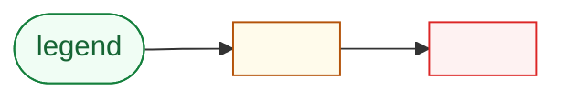
```mermaid
%% Shared class definitions (copy into each diagram if your renderer needs them)
flowchart LR
  classDef danger fill:#FEF2F2,stroke:#DC2626,color:#991B1B
  classDef warn fill:#FFFBEB,stroke:#B45309,color:#92400E
  classDef ok fill:#F0FDF4,stroke:#15803D,color:#166534
  A(["legend"]):::ok --> B[" "]:::warn --> C[" "]:::danger
```

### 5.1 Patient

#### F-P1 Sign-up → onboarding (US-01)
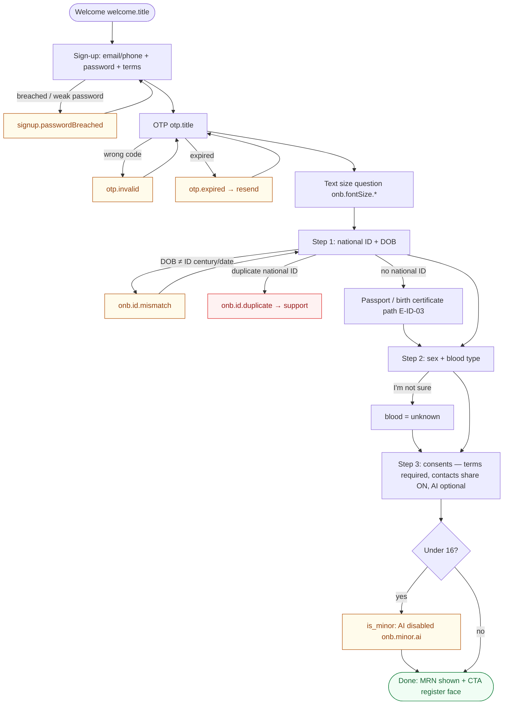
```mermaid
flowchart TD
  classDef danger fill:#FEF2F2,stroke:#DC2626,color:#991B1B
  classDef warn fill:#FFFBEB,stroke:#B45309,color:#92400E
  classDef ok fill:#F0FDF4,stroke:#15803D,color:#166534
  S(["Welcome welcome.title"]) --> SU["Sign-up: email/phone + password + terms"]
  SU -->|"breached / weak password"| SUe["signup.passwordBreached"]:::warn --> SU
  SU --> OTP["OTP otp.title"]
  OTP -->|"wrong code"| OTPe["otp.invalid"]:::warn --> OTP
  OTP -->|"expired"| OTPx["otp.expired → resend"]:::warn --> OTP
  OTP --> FS["Text size question onb.fontSize.*"]
  FS --> ID["Step 1: national ID + DOB"]
  ID -->|"DOB ≠ ID century/date"| IDe["onb.id.mismatch"]:::warn --> ID
  ID -->|"duplicate national ID"| IDd["onb.id.duplicate → support"]:::danger
  ID -->|"no national ID"| IDp["Passport / birth certificate path E-ID-03"] --> B
  ID --> B["Step 2: sex + blood type"]
  B -->|"I'm not sure"| B2["blood = unknown"] --> C
  B --> C["Step 3: consents — terms required, contacts share ON, AI optional"]
  C --> MIN{"Under 16?"}
  MIN -->|"yes"| M1["is_minor: AI disabled onb.minor.ai"]:::warn --> D
  MIN -->|"no"| D(["Done: MRN shown + CTA register face"]):::ok
```

#### F-P2 Face enrolment (EXT-03)
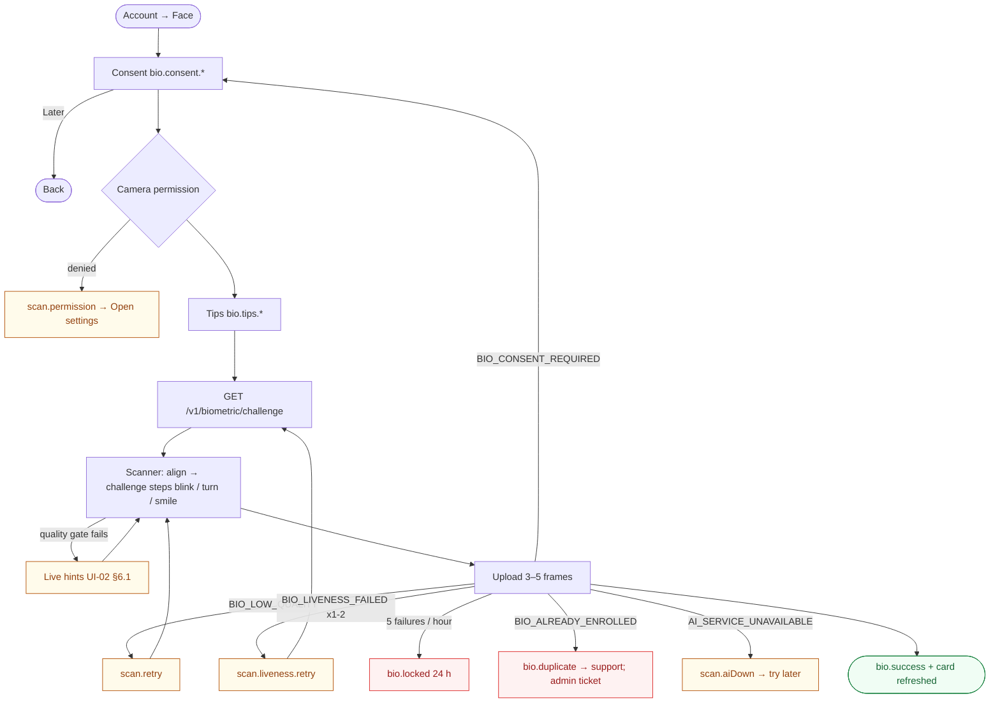
```mermaid
flowchart TD
  classDef danger fill:#FEF2F2,stroke:#DC2626,color:#991B1B
  classDef warn fill:#FFFBEB,stroke:#B45309,color:#92400E
  classDef ok fill:#F0FDF4,stroke:#15803D,color:#166534
  A(["Account → Face"]) --> CO["Consent bio.consent.*"]
  CO -->|"Later"| X(["Back"])
  CO --> P{"Camera permission"}
  P -->|"denied"| PD["scan.permission → Open settings"]:::warn
  P --> T["Tips bio.tips.*"] --> CH["GET /v1/biometric/challenge"]
  CH --> SC["Scanner: align → challenge steps blink / turn / smile"]
  SC -->|"quality gate fails"| H["Live hints UI-02 §6.1"]:::warn --> SC
  SC --> UP["Upload 3–5 frames"]
  UP -->|"BIO_LOW_QUALITY"| R1["scan.retry"]:::warn --> SC
  UP -->|"BIO_LIVENESS_FAILED x1-2"| R2["scan.liveness.retry"]:::warn --> CH
  UP -->|"5 failures / hour"| L["bio.locked 24 h"]:::danger
  UP -->|"BIO_ALREADY_ENROLLED"| DUP["bio.duplicate → support; admin ticket"]:::danger
  UP -->|"BIO_CONSENT_REQUIRED"| CO
  UP -->|"AI_SERVICE_UNAVAILABLE"| AD["scan.aiDown → try later"]:::warn
  UP --> OK(["bio.success + card refreshed"]):::ok
```

#### F-P3 Show prescription at pharmacy (US-03)
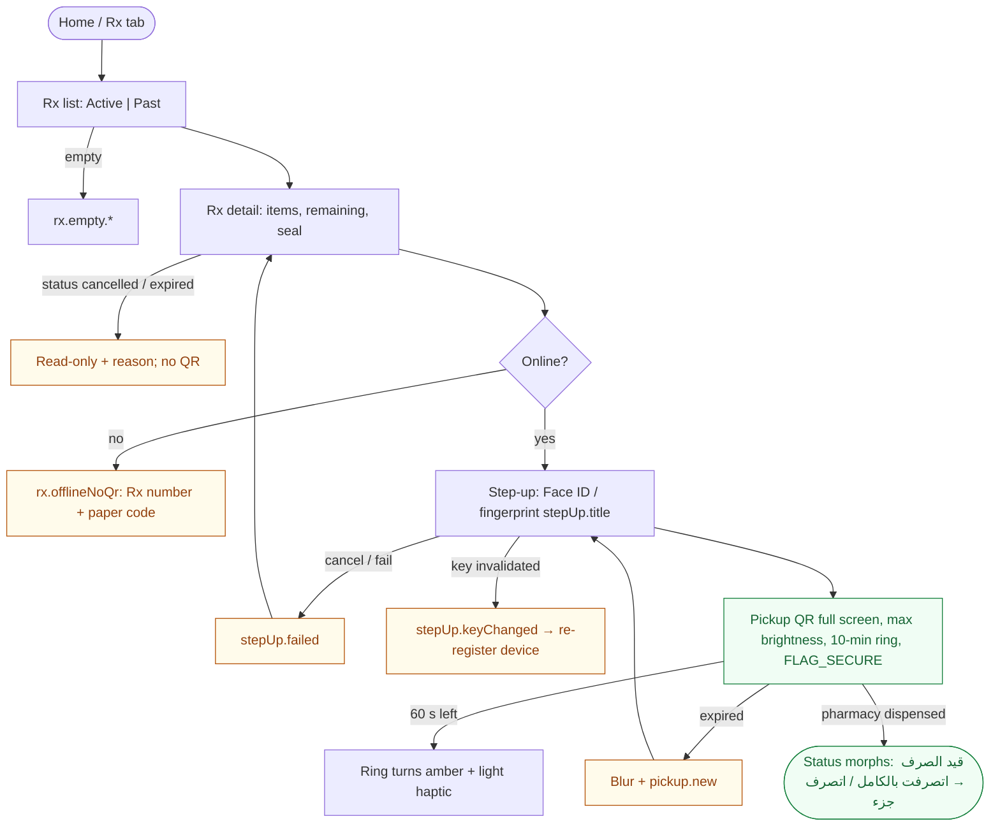
```mermaid
flowchart TD
  classDef danger fill:#FEF2F2,stroke:#DC2626,color:#991B1B
  classDef warn fill:#FFFBEB,stroke:#B45309,color:#92400E
  classDef ok fill:#F0FDF4,stroke:#15803D,color:#166534
  H(["Home / Rx tab"]) --> L["Rx list: Active | Past"]
  L -->|"empty"| E["rx.empty.*"]
  L --> D["Rx detail: items, remaining, seal"] 
  D -->|"status cancelled / expired"| CX["Read-only + reason; no QR"]:::warn
  D --> NET{"Online?"}
  NET -->|"no"| OFF["rx.offlineNoQr: Rx number + paper code"]:::warn
  NET -->|"yes"| SU["Step-up: Face ID / fingerprint stepUp.title"]
  SU -->|"cancel / fail"| SUF["stepUp.failed"]:::warn --> D
  SU -->|"key invalidated"| KI["stepUp.keyChanged → re-register device"]:::warn
  SU --> QR["Pickup QR full screen, max brightness, 10-min ring, FLAG_SECURE"]:::ok
  QR -->|"60 s left"| W["Ring turns amber + light haptic"]
  QR -->|"expired"| EXP["Blur + pickup.new"]:::warn --> SU
  QR -->|"pharmacy dispensed"| DONE(["Status morphs: قيد الصرف → اتصرفت بالكامل / اتصرف جزء"]):::ok
```

#### F-P4 AI assistant (US-13…15, E-AI-*)
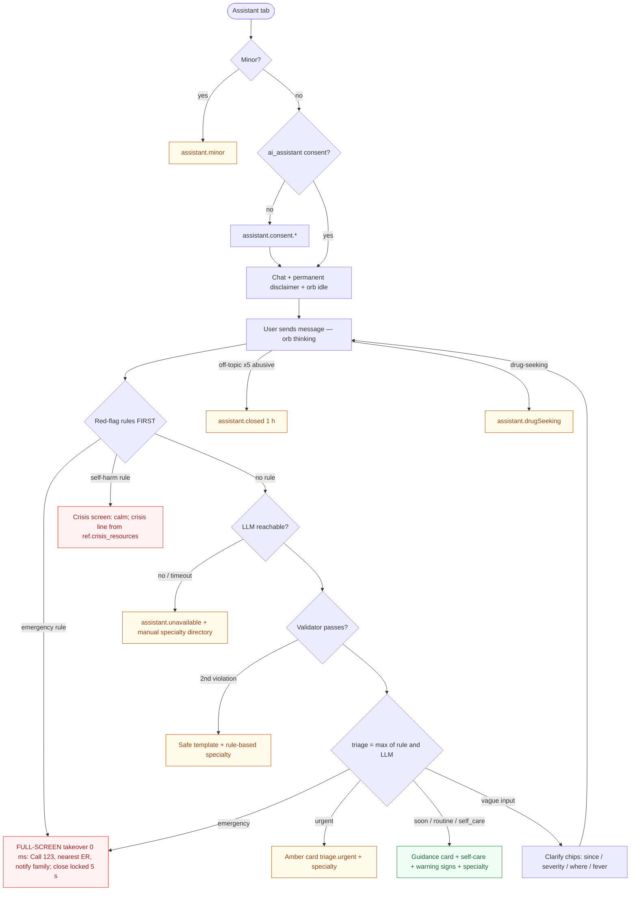
```mermaid
flowchart TD
  classDef danger fill:#FEF2F2,stroke:#DC2626,color:#991B1B
  classDef warn fill:#FFFBEB,stroke:#B45309,color:#92400E
  classDef ok fill:#F0FDF4,stroke:#15803D,color:#166534
  A(["Assistant tab"]) --> MI{"Minor?"}
  MI -->|"yes"| MN["assistant.minor"]:::warn
  MI -->|"no"| CS{"ai_assistant consent?"}
  CS -->|"no"| CO["assistant.consent.*"] --> CH
  CS -->|"yes"| CH["Chat + permanent disclaimer + orb idle"]
  CH --> MSG["User sends message — orb thinking"]
  MSG --> RF{"Red-flag rules FIRST"}
  RF -->|"emergency rule"| TK["FULL-SCREEN takeover 0 ms: Call 123, nearest ER, notify family; close locked 5 s"]:::danger
  RF -->|"self-harm rule"| CR["Crisis screen: calm; crisis line from ref.crisis_resources"]:::danger
  RF -->|"no rule"| LLM{"LLM reachable?"}
  LLM -->|"no / timeout"| FB["assistant.unavailable + manual specialty directory"]:::warn
  LLM --> VAL{"Validator passes?"}
  VAL -->|"2nd violation"| SAFE["Safe template + rule-based specialty"]:::warn
  VAL --> TRI{"triage = max of rule and LLM"}
  TRI -->|"emergency"| TK
  TRI -->|"urgent"| U["Amber card triage.urgent + specialty"]:::warn
  TRI -->|"soon / routine / self_care"| G["Guidance card + self-care + warning signs + specialty"]:::ok
  TRI -->|"vague input"| CL["Clarify chips: since / severity / where / fever"] --> MSG
  MSG -->|"off-topic x5 abusive"| CLS["assistant.closed 1 h"]:::warn
  MSG -->|"drug-seeking"| DS["assistant.drugSeeking"]:::warn
```

#### F-P5 Share with a doctor & revoke (US-09, US-20)
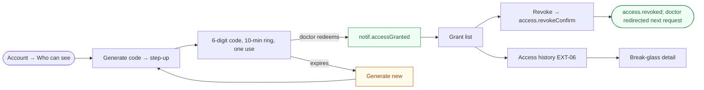
```mermaid
flowchart LR
  classDef warn fill:#FFFBEB,stroke:#B45309,color:#92400E
  classDef ok fill:#F0FDF4,stroke:#15803D,color:#166534
  A(["Account → Who can see"]) --> G["Generate code → step-up"]
  G --> C["6-digit code, 10-min ring, one use"]
  C -->|"doctor redeems"| N["notif.accessGranted"]:::ok --> L["Grant list"]
  C -->|"expires"| C2["Generate new"]:::warn --> G
  L --> R["Revoke → access.revokeConfirm"] --> RV(["access.revoked; doctor redirected next request"]):::ok
  L --> H["Access history EXT-06"] --> BG["Break-glass detail"]
```

#### F-P6 Emergency contacts (US-05)
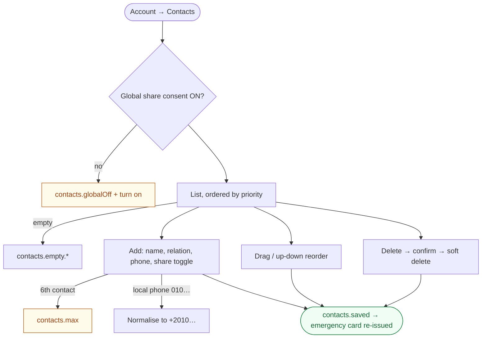
```mermaid
flowchart TD
  classDef warn fill:#FFFBEB,stroke:#B45309,color:#92400E
  classDef ok fill:#F0FDF4,stroke:#15803D,color:#166534
  A(["Account → Contacts"]) --> GL{"Global share consent ON?"}
  GL -->|"no"| OFF["contacts.globalOff + turn on"]:::warn
  GL --> LS["List, ordered by priority"]
  LS -->|"empty"| EM["contacts.empty.*"]
  LS --> ADD["Add: name, relation, phone, share toggle"]
  ADD -->|"6th contact"| MX["contacts.max"]:::warn
  ADD -->|"local phone 010…"| NRM["Normalise to +2010…"]
  ADD --> SV(["contacts.saved → emergency card re-issued"]):::ok
  LS --> RO["Drag / up-down reorder"] --> SV
  LS --> DEL["Delete → confirm → soft delete"] --> SV
```

#### F-P7 Emergency card without login (EXT-04)
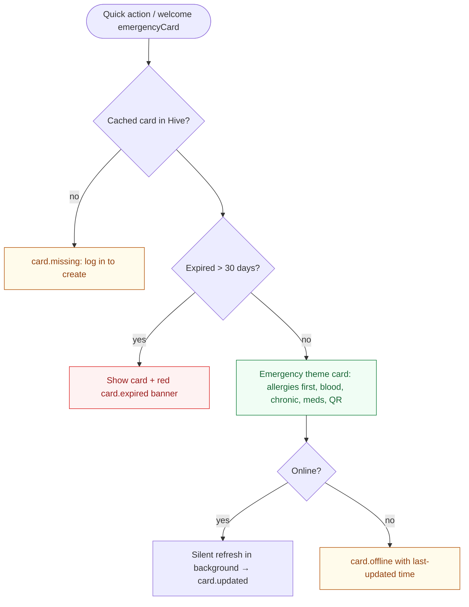
```mermaid
flowchart TD
  classDef danger fill:#FEF2F2,stroke:#DC2626,color:#991B1B
  classDef warn fill:#FFFBEB,stroke:#B45309,color:#92400E
  classDef ok fill:#F0FDF4,stroke:#15803D,color:#166534
  Q(["Quick action / welcome emergencyCard"]) --> HC{"Cached card in Hive?"}
  HC -->|"no"| NC["card.missing: log in to create"]:::warn
  HC --> EXP{"Expired > 30 days?"}
  EXP -->|"yes"| EX["Show card + red card.expired banner"]:::danger
  EXP -->|"no"| OK["Emergency theme card: allergies first, blood, chronic, meds, QR"]:::ok
  OK --> ON{"Online?"}
  ON -->|"yes"| RF["Silent refresh in background → card.updated"]
  ON -->|"no"| OF["card.offline with last-updated time"]:::warn
```

#### F-P8 Break-glass transparency (US-17-AC4)
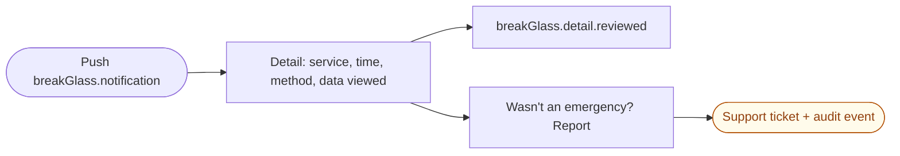
```mermaid
flowchart LR
  classDef warn fill:#FFFBEB,stroke:#B45309,color:#92400E
  P(["Push breakGlass.notification"]) --> D["Detail: service, time, method, data viewed"]
  D --> R["breakGlass.detail.reviewed"]
  D --> NM["Wasn't an emergency? Report"] --> T(["Support ticket + audit event"]):::warn
```

### 5.2 Doctor (web)

#### F-D1 Login → MFA → dashboard (US-19)
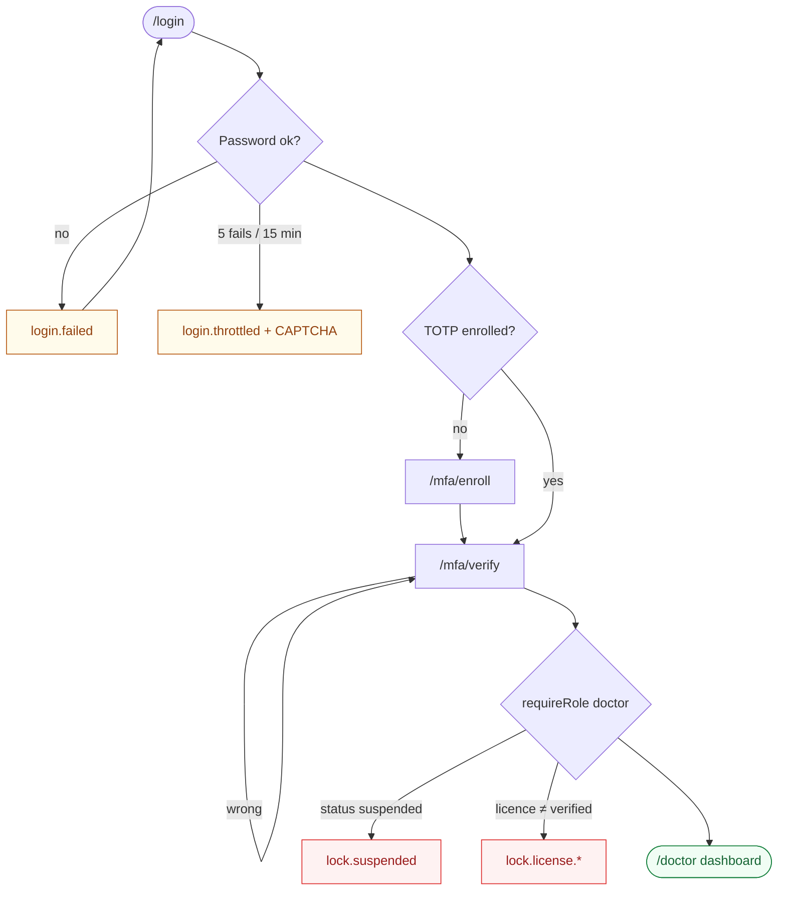
```mermaid
flowchart TD
  classDef danger fill:#FEF2F2,stroke:#DC2626,color:#991B1B
  classDef warn fill:#FFFBEB,stroke:#B45309,color:#92400E
  classDef ok fill:#F0FDF4,stroke:#15803D,color:#166534
  L(["/login"]) --> PW{"Password ok?"}
  PW -->|"no"| E1["login.failed"]:::warn --> L
  PW -->|"5 fails / 15 min"| TH["login.throttled + CAPTCHA"]:::warn
  PW --> F{"TOTP enrolled?"}
  F -->|"no"| EN["/mfa/enroll"] --> V
  F -->|"yes"| V["/mfa/verify"]
  V -->|"wrong"| V
  V --> RR{"requireRole doctor"}
  RR -->|"status suspended"| S["lock.suspended"]:::danger
  RR -->|"licence ≠ verified"| LI["lock.license.*"]:::danger
  RR --> D(["/doctor dashboard"]):::ok
```

#### F-D2 Open a patient (US-09, E-PRIV-04/05)
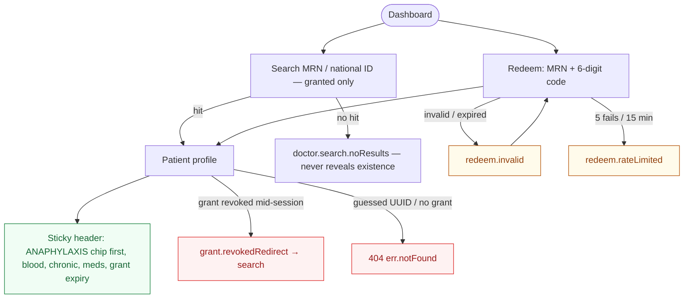
```mermaid
flowchart TD
  classDef danger fill:#FEF2F2,stroke:#DC2626,color:#991B1B
  classDef warn fill:#FFFBEB,stroke:#B45309,color:#92400E
  classDef ok fill:#F0FDF4,stroke:#15803D,color:#166534
  D(["Dashboard"]) --> S["Search MRN / national ID — granted only"]
  S -->|"hit"| P["Patient profile"]
  S -->|"no hit"| N["doctor.search.noResults — never reveals existence"]
  D --> R["Redeem: MRN + 6-digit code"]
  R -->|"invalid / expired"| RI["redeem.invalid"]:::warn --> R
  R -->|"5 fails / 15 min"| RL["redeem.rateLimited"]:::warn
  R --> P
  P --> HDR["Sticky header: ANAPHYLAXIS chip first, blood, chronic, meds, grant expiry"]:::ok
  P -->|"grant revoked mid-session"| GR["grant.revokedRedirect → search"]:::danger
  P -->|"guessed UUID / no grant"| NF["404 err.notFound"]:::danger
```

#### F-D3 Encounter & diagnoses (US-06, US-07)
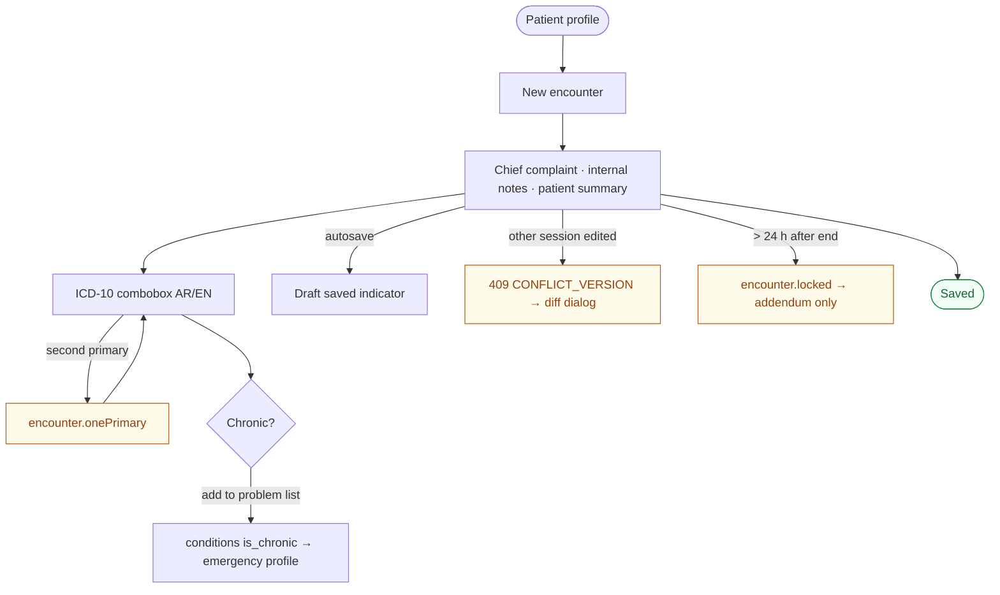
```mermaid
flowchart TD
  classDef warn fill:#FFFBEB,stroke:#B45309,color:#92400E
  classDef ok fill:#F0FDF4,stroke:#15803D,color:#166534
  P(["Patient profile"]) --> NE["New encounter"] --> F["Chief complaint · internal notes · patient summary"]
  F --> DX["ICD-10 combobox AR/EN"]
  DX -->|"second primary"| DP["encounter.onePrimary"]:::warn --> DX
  DX --> CHR{"Chronic?"} -->|"add to problem list"| PL["conditions is_chronic → emergency profile"]
  F -->|"autosave"| AS["Draft saved indicator"]
  F -->|"other session edited"| CF["409 CONFLICT_VERSION → diff dialog"]:::warn
  F -->|"> 24 h after end"| LK["encounter.locked → addendum only"]:::warn
  F --> SV(["Saved"]):::ok
```

#### F-D4 Prescription Builder with live safety engine (US-08, EXT-01/02, E-CLIN-*)
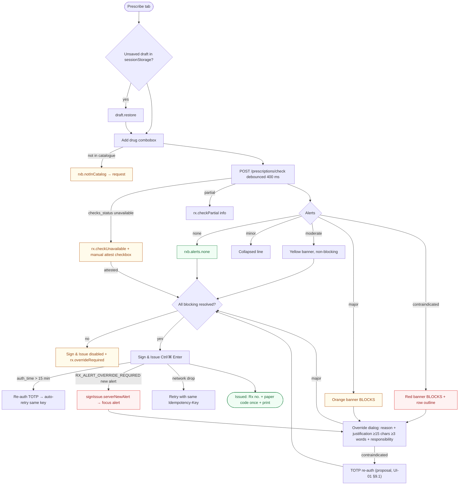
```mermaid
flowchart TD
  classDef danger fill:#FEF2F2,stroke:#DC2626,color:#991B1B
  classDef warn fill:#FFFBEB,stroke:#B45309,color:#92400E
  classDef ok fill:#F0FDF4,stroke:#15803D,color:#166534
  B(["Prescribe tab"]) --> DR{"Unsaved draft in sessionStorage?"}
  DR -->|"yes"| RS["draft.restore"] --> AD
  DR --> AD["Add drug combobox"]
  AD -->|"not in catalogue"| RQ["rxb.notInCatalog → request"]:::warn
  AD --> CK["POST /prescriptions/check debounced 400 ms"]
  CK -->|"checks_status unavailable"| UN["rx.checkUnavailable + manual attest checkbox"]:::warn
  CK -->|"partial"| PA["rx.checkPartial info"]
  CK --> AL{"Alerts"}
  AL -->|"none"| OK1["rxb.alerts.none"]:::ok
  AL -->|"minor"| MN["Collapsed line"]
  AL -->|"moderate"| MD["Yellow banner, non-blocking"]
  AL -->|"major"| MJ["Orange banner BLOCKS"]:::warn
  AL -->|"contraindicated"| CT["Red banner BLOCKS + row outline"]:::danger
  MJ --> OV["Override dialog: reason + justification ≥15 chars ≥3 words + responsibility"]
  CT --> OV
  OV -->|"contraindicated"| RA["TOTP re-auth (proposal, UI-01 §9.1)"]
  RA --> RDY
  OV -->|"major"| RDY{"All blocking resolved?"}
  UN -->|"attested"| RDY
  OK1 --> RDY
  MD --> RDY
  RDY -->|"no"| BL["Sign & Issue disabled + rx.overrideRequired"]:::warn
  RDY -->|"yes"| SI["Sign & Issue Ctrl/⌘ Enter"]
  SI -->|"auth_time > 15 min"| ST["Re-auth TOTP → auto-retry same key"]
  SI -->|"RX_ALERT_OVERRIDE_REQUIRED new alert"| NA["signIssue.serverNewAlert → focus alert"]:::danger --> OV
  SI -->|"network drop"| RT["Retry with same Idempotency-Key"]
  SI --> IS(["Issued: Rx no. + paper code once + print"]):::ok
```

#### F-D5 Cancel a prescription (US-08-AC6, E-RX-08)
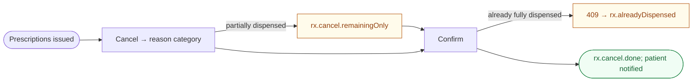
```mermaid
flowchart LR
  classDef warn fill:#FFFBEB,stroke:#B45309,color:#92400E
  classDef ok fill:#F0FDF4,stroke:#15803D,color:#166534
  L(["Prescriptions issued"]) --> C["Cancel → reason category"]
  C -->|"partially dispensed"| PR["rx.cancel.remainingOnly"]:::warn --> CF
  C --> CF["Confirm"]
  CF -->|"already fully dispensed"| AD["409 → rx.alreadyDispensed"]:::warn
  CF --> OK(["rx.cancel.done; patient notified"]):::ok
```

#### F-D6 Session timeout mid-form (E-NET-06, role-05 §4.3)
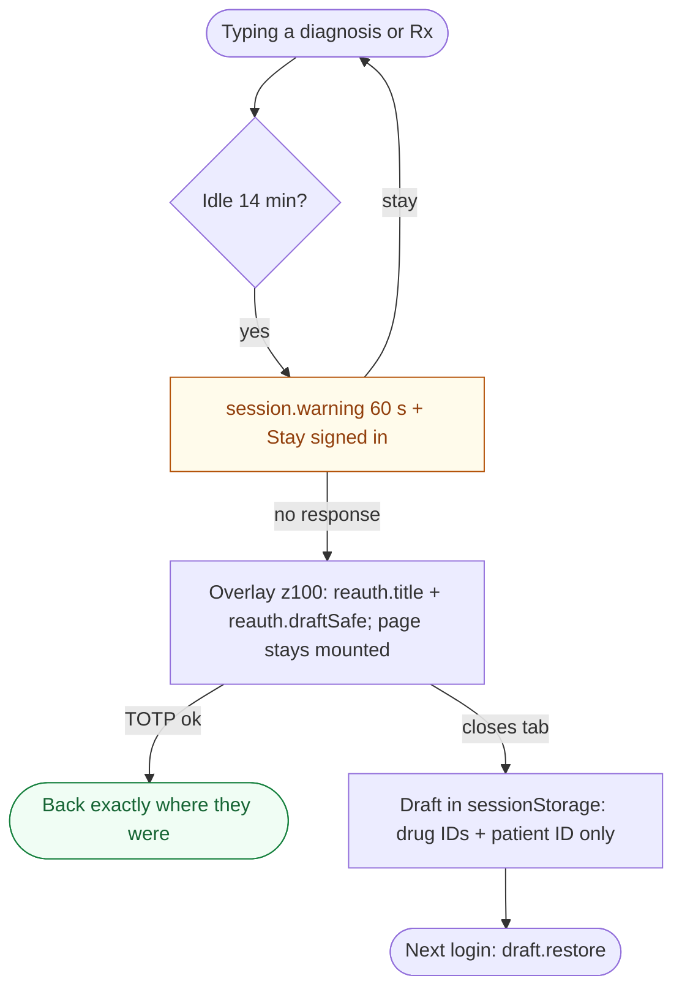
```mermaid
flowchart TD
  classDef warn fill:#FFFBEB,stroke:#B45309,color:#92400E
  classDef ok fill:#F0FDF4,stroke:#15803D,color:#166534
  F(["Typing a diagnosis or Rx"]) --> I{"Idle 14 min?"}
  I -->|"yes"| W["session.warning 60 s + Stay signed in"]:::warn
  W -->|"stay"| F
  W -->|"no response"| LO["Overlay z100: reauth.title + reauth.draftSafe; page stays mounted"]
  LO -->|"TOTP ok"| F2(["Back exactly where they were"]):::ok
  LO -->|"closes tab"| SS["Draft in sessionStorage: drug IDs + patient ID only"] --> NX(["Next login: draft.restore"])
```

### 5.3 Pharmacist (web + mobile)

#### F-F1 Verify by QR (US-10, E-RX-05..07, E-LIC-02)
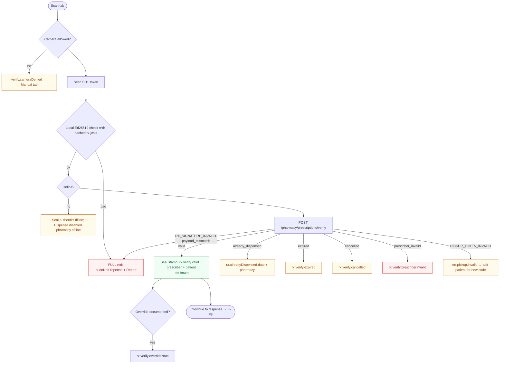
```mermaid
flowchart TD
  classDef danger fill:#FEF2F2,stroke:#DC2626,color:#991B1B
  classDef warn fill:#FFFBEB,stroke:#B45309,color:#92400E
  classDef ok fill:#F0FDF4,stroke:#15803D,color:#166534
  A(["Scan tab"]) --> CAM{"Camera allowed?"}
  CAM -->|"no"| CD["verify.cameraDenied → Manual tab"]:::warn
  CAM --> SC["Scan SH1 token"]
  SC --> LOC{"Local Ed25519 check with cached rx-jwks"}
  LOC -->|"bad"| RED["FULL red: rx.doNotDispense + Report"]:::danger
  LOC -->|"ok"| NET{"Online?"}
  NET -->|"no"| AO["Seal authenticOffline; Dispense disabled pharmacy.offline"]:::warn
  NET --> VF["POST /pharmacy/prescriptions/verify"]
  VF -->|"valid"| V["Seal stamp: rx.verify.valid + prescriber + patient minimum"]:::ok
  VF -->|"already_dispensed"| AD["rx.alreadyDispensed date + pharmacy"]:::warn
  VF -->|"expired"| EX["rx.verify.expired"]:::warn
  VF -->|"cancelled"| CN["rx.verify.cancelled"]:::warn
  VF -->|"prescriber_invalid"| PI["rx.verify.prescriberInvalid"]:::danger
  VF -->|"PICKUP_TOKEN_INVALID"| PT["err.pickup.invalid → ask patient for new code"]:::warn
  VF -->|"RX_SIGNATURE_INVALID payload_mismatch"| RED
  V --> OVN{"Override documented?"} -->|"yes"| ON["rx.verify.overrideNote"]
  V --> CONT(["Continue to dispense → F-F3"])
```

#### F-F2 Manual Rx + presence (US-10-AC4, E-RX-10)
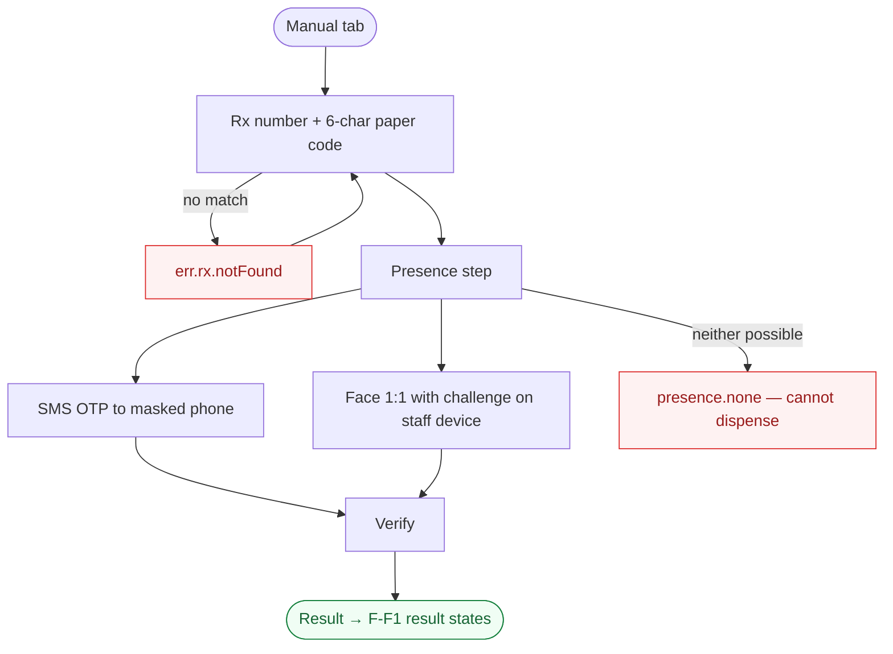
```mermaid
flowchart TD
  classDef danger fill:#FEF2F2,stroke:#DC2626,color:#991B1B
  classDef ok fill:#F0FDF4,stroke:#15803D,color:#166534
  M(["Manual tab"]) --> E["Rx number + 6-char paper code"]
  E -->|"no match"| NF["err.rx.notFound"]:::danger --> E
  E --> PR["Presence step"]
  PR --> SMS["SMS OTP to masked phone"] --> VF
  PR --> FACE["Face 1:1 with challenge on staff device"] --> VF
  PR -->|"neither possible"| NO["presence.none — cannot dispense"]:::danger
  VF["Verify"] --> R(["Result → F-F1 result states"]):::ok
```

#### F-F3 Dispense: full, partial, race, offline (US-11/12, E-RX-01..04, E-NET-03/04)
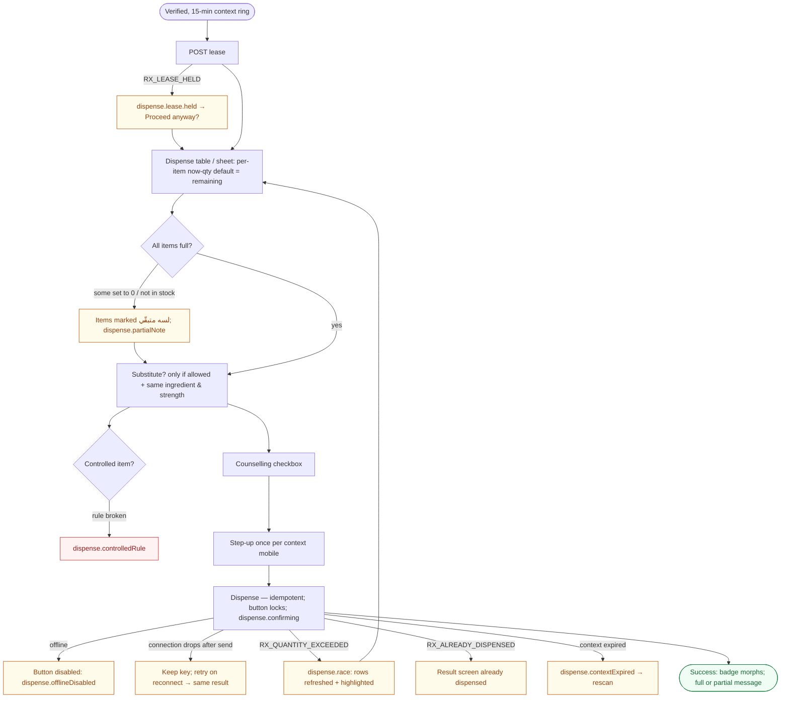
```mermaid
flowchart TD
  classDef danger fill:#FEF2F2,stroke:#DC2626,color:#991B1B
  classDef warn fill:#FFFBEB,stroke:#B45309,color:#92400E
  classDef ok fill:#F0FDF4,stroke:#15803D,color:#166534
  V(["Verified, 15-min context ring"]) --> LE["POST lease"]
  LE -->|"RX_LEASE_HELD"| LH["dispense.lease.held → Proceed anyway?"]:::warn --> T
  LE --> T["Dispense table / sheet: per-item now-qty default = remaining"]
  T --> P{"All items full?"}
  P -->|"some set to 0 / not in stock"| PART["Items marked لسه متبقّي; dispense.partialNote"]:::warn --> SUB
  P -->|"yes"| SUB["Substitute? only if allowed + same ingredient & strength"]
  SUB --> CTRL{"Controlled item?"} -->|"rule broken"| CR["dispense.controlledRule"]:::danger
  SUB --> CO["Counselling checkbox"] --> SU["Step-up once per context mobile"]
  SU --> D["Dispense — idempotent; button locks; dispense.confirming"]
  D -->|"offline"| OFF["Button disabled: dispense.offlineDisabled"]:::warn
  D -->|"connection drops after send"| RT["Keep key; retry on reconnect → same result"]:::warn
  D -->|"RX_QUANTITY_EXCEEDED"| RACE["dispense.race: rows refreshed + highlighted"]:::warn --> T
  D -->|"RX_ALREADY_DISPENSED"| AD["Result screen already dispensed"]:::warn
  D -->|"context expired"| CE["dispense.contextExpired → rescan"]:::warn
  D --> OK(["Success: badge morphs; full or partial message"]):::ok
```

### 5.4 Paramedic (mobile) & ER desk (web)

#### F-E1 Shift start
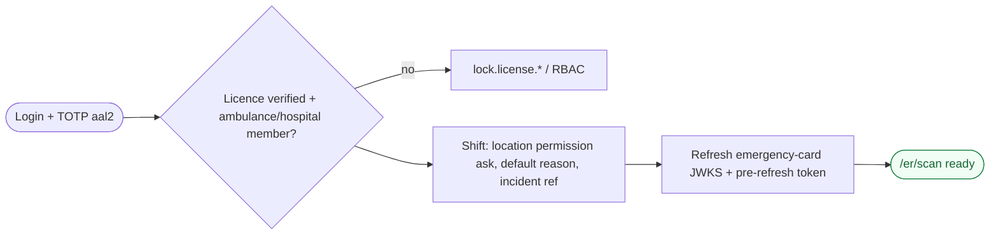
```mermaid
flowchart LR
  classDef ok fill:#F0FDF4,stroke:#15803D,color:#166534
  L(["Login + TOTP aal2"]) --> LIC{"Licence verified + ambulance/hospital member?"}
  LIC -->|"no"| X["lock.license.* / RBAC"]
  LIC --> SH["Shift: location permission ask, default reason, incident ref"]
  SH --> JW["Refresh emergency-card JWKS + pre-refresh token"]
  JW --> SC(["/er/scan ready"]):::ok
```

#### F-E2 Identify by face (US-16, E-BIO-01..08, E-BIO-12, E-NET-01/02)
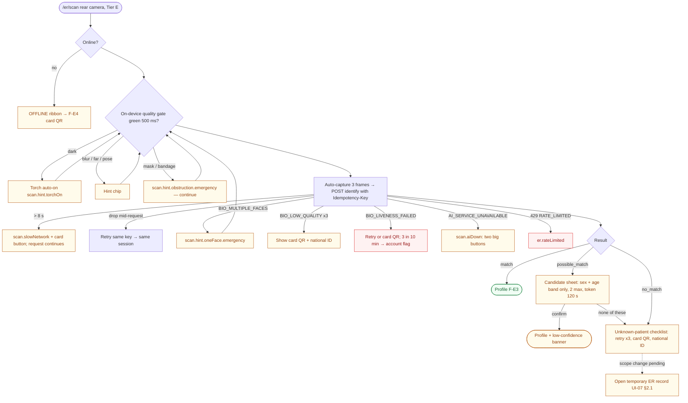
```mermaid
flowchart TD
  classDef danger fill:#FEF2F2,stroke:#DC2626,color:#991B1B
  classDef warn fill:#FFFBEB,stroke:#B45309,color:#92400E
  classDef ok fill:#F0FDF4,stroke:#15803D,color:#166534
  S(["/er/scan rear camera, Tier E"]) --> NET{"Online?"}
  NET -->|"no"| OFF["OFFLINE ribbon → F-E4 card QR"]:::warn
  NET --> Q{"On-device quality gate green 500 ms?"}
  Q -->|"dark"| T["Torch auto-on scan.hint.torchOn"]:::warn --> Q
  Q -->|"blur / far / pose"| H["Hint chip"]:::warn --> Q
  Q -->|"mask / bandage"| OB["scan.hint.obstruction.emergency — continue"]:::warn --> Q
  Q --> CAP["Auto-capture 3 frames → POST identify with Idempotency-Key"]
  CAP -->|"> 8 s"| SL["scan.slowNetwork + card button; request continues"]:::warn
  CAP -->|"drop mid-request"| RT["Retry same key → same session"]
  CAP -->|"BIO_MULTIPLE_FACES"| MF["scan.hint.oneFace.emergency"]:::warn --> Q
  CAP -->|"BIO_LOW_QUALITY x3"| ALT["Show card QR + national ID"]:::warn
  CAP -->|"BIO_LIVENESS_FAILED"| LV["Retry or card QR; 3 in 10 min → account flag"]:::danger
  CAP -->|"AI_SERVICE_UNAVAILABLE"| AD["scan.aiDown: two big buttons"]:::warn
  CAP -->|"429 RATE_LIMITED"| RL["er.rateLimited"]:::danger
  CAP --> R{"Result"}
  R -->|"match"| PRF(["Profile F-E3"]):::ok
  R -->|"possible_match"| PM["Candidate sheet: sex + age band only, 2 max, token 120 s"]:::warn
  PM -->|"confirm"| PRF2(["Profile + low-confidence banner"]):::warn
  PM -->|"none of these"| NM
  R -->|"no_match"| NM["Unknown-patient checklist: retry x3, card QR, national ID"]:::warn
  NM -.->|"scope change pending"| TMP["Open temporary ER record UI-07 §2.1"]:::warn
```

#### F-E3 Profile, contacts, session lifecycle (US-17, US-18)
```mermaid
flowchart TD
  classDef danger fill:#FEF2F2,stroke:#DC2626,color:#991B1B
  classDef warn fill:#FFFBEB,stroke:#B45309,color:#92400E
  classDef ok fill:#F0FDF4,stroke:#15803D,color:#166534
  P(["Profile: ALLERGIES red block first → blood → chronic → meds; timer"]) --> C["Call contact"]
  C -->|"has_shared_contacts false / 403"| NC["er.profile.noContacts"]:::warn
  C --> CL["Contacts by priority → 72 dp call → tel:"]:::ok
  P -->|"patient edits contacts meanwhile"| LIVE["Next fetch shows live list E-PRIV-01"]
  P -->|"10 min left"| EXT{"Extend?"}
  EXT -->|"first time + reason"| E2["+30 min"]:::ok
  EXT -->|"second time"| EU["er.session.extendUsed"]:::warn
  P -->|"expired"| EX["410 → er.session.expired → rescan"]:::danger
  P --> CLS(["Close case → POST close"]):::ok
  P -->|"try history route"| RB["403 RBAC_FORBIDDEN — no route exists in UI"]:::danger
```

#### F-E4 Offline card QR + outbox (EXT-04, E-NET-01)
```mermaid
flowchart TD
  classDef danger fill:#FEF2F2,stroke:#DC2626,color:#991B1B
  classDef warn fill:#FFFBEB,stroke:#B45309,color:#92400E
  classDef ok fill:#F0FDF4,stroke:#15803D,color:#166534
  A(["Scan card QR"]) --> P["Decode SHEC1 payload"]
  P --> J{"Verify Ed25519 with cached JWKS"}
  J -->|"fail"| INV["er.offline.cardInvalid"]:::danger
  J -->|"unknown kid / JWKS stale"| ST["Warn + treat as unverified"]:::warn
  J --> EXP{"Card expired?"}
  EXP -->|"yes"| EB["Show + er.offline.cardExpired"]:::warn --> Q
  EXP -->|"no"| SH["Show card + er.offline.cardBanner"]:::ok --> Q
  Q["Queue offline_card_view in encrypted audit_outbox, device-signed"] --> NET{"Back online?"}
  NET -->|"yes"| FL["POST offline-events → 202 → delete"] --> LV["Offer er.offline.openLive"]
  NET -->|"no"| W["er.offline.queued count; retry every 5 s"]
```

#### F-E5 National ID search (E-BIO-01, 03 §9.3)
```mermaid
flowchart LR
  classDef warn fill:#FFFBEB,stroke:#B45309,color:#92400E
  classDef ok fill:#F0FDF4,stroke:#15803D,color:#166534
  A(["National ID"]) --> W["er.nationalId.onlyIfHeld"] --> I["14-digit input + reason"]
  I -->|"5 / hour exceeded"| RL["er.rateLimited"]:::warn
  I --> R{"Result"} -->|"match"| P(["Profile, method manual_search"]):::ok
  R -->|"no_match"| N["Unknown-patient checklist"]:::warn
```

#### F-ER1 ER desktop console (web, Sunlight theme)
```mermaid
flowchart TD
  classDef warn fill:#FFFBEB,stroke:#B45309,color:#92400E
  classDef ok fill:#F0FDF4,stroke:#15803D,color:#166534
  B(["/er board: active sessions by this hospital, timers"]) --> ID["/er/identify"]
  ID --> W["Webcam face 2D guide"] --> R
  ID --> Q["USB/webcam card QR"] --> R
  ID --> N["National ID"] --> R
  R{"Result"} -->|"match / confirmed"| S(["/er/sessions/id profile, Sunlight, F11-friendly"]):::ok
  R -->|"possible"| PC["Candidate confirm dialog"]:::warn --> S
  R -->|"no match"| UK["Unknown-patient checklist"]:::warn
```

### 5.5 Admin (web)

#### F-A1 Invite & verify licence (US-21-AC1)
```mermaid
flowchart LR
  classDef ok fill:#F0FDF4,stroke:#15803D,color:#166534
  U(["Users"]) --> I["Invite form: email, name, role, licence no./authority/expiry, specialty, facilities"]
  I --> S["admin.invite.sent; licence pending"]
  S --> L["Licence panel: documents check"]
  L --> V["Verify → re-auth ≤ 5 min"] --> OK(["Practitioner can work"]):::ok
```

#### F-A2 Suspend / revoke / role change (US-21, E-LIC-01/02/06)
```mermaid
flowchart TD
  classDef danger fill:#FEF2F2,stroke:#DC2626,color:#991B1B
  classDef warn fill:#FFFBEB,stroke:#B45309,color:#92400E
  classDef ok fill:#F0FDF4,stroke:#15803D,color:#166534
  U(["User row"]) --> SELF{"Own account?"}
  SELF -->|"yes"| X["admin.users.selfAction"]:::danger
  SELF --> A{"Action"}
  A -->|"suspend"| SP["Reason required → re-auth"] --> SPO(["Signed out everywhere ≤ 30 s"]):::ok
  A -->|"revoke licence"| RV["admin.license.revokeImpact N open Rx"] --> RA["Re-auth"] --> RVO(["Rx flagged prescriber_invalid; patients notified"]):::danger
  A -->|"suspend licence"| SL["admin.license.suspendImpact"] --> RA2["Re-auth"] --> SLO(["Earlier Rx still dispensable"]):::warn
  A -->|"make admin"| TP["Two-person: admin.users.pendingApproval"] --> AP{"Second admin approves?"}
  AP -->|"yes"| OK(["Role changed"]):::ok
  AP -->|"no"| RJ(["Rejected"])
```

#### F-A3 Audit & integrity (EXT-05)
```mermaid
flowchart LR
  classDef danger fill:#FEF2F2,stroke:#DC2626,color:#991B1B
  classDef ok fill:#F0FDF4,stroke:#15803D,color:#166534
  A(["Audit"]) --> F["Filters: actor, action, MRN via blind index, outcome, dates"] --> T["Virtualised table"]
  T --> X["Export CSV, PHI columns excluded"]
  A --> B{"Chain badge"}
  B -->|"verified"| G["admin.audit.chainOk"]:::ok
  B -->|"broken"| R["admin.audit.chainBroken #N → critical alert"]:::danger
```

#### F-A4 Break-glass review & security flags (EXT-05-AC2, E-BIO-05, E-RX-05)
```mermaid
flowchart LR
  classDef warn fill:#FFFBEB,stroke:#B45309,color:#92400E
  Q(["Review queue — low-confidence first"]) --> C["Card: paramedic, service, method, reason, incident ref, map pin"]
  C --> AP["Appropriate + note"]
  C --> IN["Inappropriate + note"]:::warn --> FL["Security flag + follow-up"]
  S(["Security flags"]) --> SP["Spoof attempts"] --> AU["Open actor's audit trail"]
  S --> FR["Forged Rx cluster by pharmacy"] --> AU
```

---

## 6. Task Budgets (taps / clicks from shell home)

| Task | Role | Budget | Path |
|------|------|-------:|------|
| See own allergies & blood type | Patient | **1** | Home (ID card shows them) |
| Show emergency card when locked out | Patient | **1** | Quick action / welcome button |
| Show Rx at pharmacy | Patient | **3** | Home Rx tile → Rx → «ورّي الكود» (+ Face ID) |
| Add emergency contact | Patient | 3 + form | Account → Contacts → Add |
| Chest-pain message → call ambulance | Patient | **2** | Send → takeover «اتصل» |
| Identify unconscious patient & read allergy | Paramedic | **≤ 3** (≤ 10 s) | Open app (1) → auto-capture (0) → profile (0); call (2) |
| Offline card path | Paramedic | **2** | Open (1) → «امسح كارت الطوارئ» (2) |
| Open a patient with a code | Doctor | 2 + typing | Dashboard → Redeem → Open |
| Prescribe 2 drugs, no alerts | Doctor | 4 + typing | Prescribe tab → add ×2 → Sign & Issue |
| Verify + dispense full | Pharmacist | **3** | Scan (auto) → Continue → Dispense |
| Partial dispense 2 of 3 | Pharmacist | 4 | Scan → Continue → set one row to 0 → Dispense |
| Suspend a user | Admin | 4 + reason | Users → row menu → Suspend → re-auth |

---

## 7. Role × Navigation Visibility Matrix

| Area | Patient | Doctor | Pharmacist | Paramedic | Admin |
|------|:------:|:------:|:----------:|:---------:|:-----:|
| Own record / Rx / card / assistant | ✅ mobile | — | — | — | — |
| Granted patient full record | — | ✅ web | — | — | — |
| Rx verify & dispense (minimum patient info) | — | — | ✅ web + mobile | — | — |
| Emergency profile (6 fields, session-bound) | — | — | — | ✅ mobile + ER desk | — |
| Users, licences, facilities, audit, break-glass review | — | — | — | — | ✅ web |
| Clinical data of any patient | own | granted | Rx-scoped | session-scoped | **never** (US-21-AC5) |

Any route outside a role's column is **absent from the UI** (not just disabled) and is also refused by the server (403/404).

---

## 8. Definition of Done (UI-04)
- [ ] Every screen ID in §2.2 and §3 has a UI-05 / UI-06 spec.
- [ ] Every flow in §5 has a Figma prototype path (P0 flows first: F-P3, F-P4, F-D4, F-F1, F-F3, F-E2, F-E3).
- [ ] Each edge branch in the diagrams maps to a row in UI-07.
- [ ] Task budgets in §6 measured in the usability test (role-07 §10).
- [ ] Route lists match `web-admin/app/[locale]/**` and `mobile-app/lib/core/router/app_router.dart` (CI check comparing route manifests to this file's tables).
